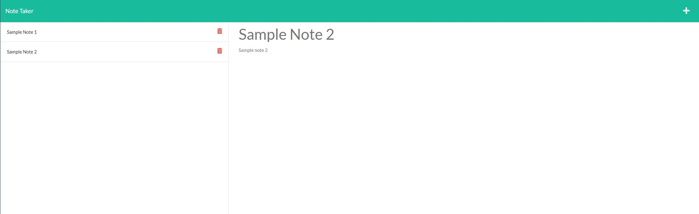

# Note Taker


## Description
The goal of this application was to build an application that allowed users to take notes. The application lets users title a specific note, add text to their note, and save their note. Upon saving, the user's note is then saved and displayed on the left hand side. This allows users to go back and select different notes that they have taken. The application also allows users to delete their notes if they no longer want them to appear in their saved section.

## Table of Contents

- [User Story](#user-story)
- [Acceptance Criteria](#acceptance-criteria)
- [Usage](#usage)
- [Credits](#credits)

## User Story

```
AS A small business owner
I WANT to be able to write and save notes
SO THAT I can organize my thoughts and keep track of tasks I need to complete
```

## Acceptance Criteria

```
GIVEN a note-taking application
WHEN I open the Note Taker
THEN I am presented with a landing page with a link to a notes page
WHEN I click on the link to the notes page
THEN I am presented with a page with existing notes listed in the left-hand column, plus empty fields to enter a new note title and the note’s text in the right-hand column
WHEN I enter a new note title and the note’s text
THEN a Save icon appears in the navigation at the top of the page
WHEN I click on the Save icon
THEN the new note I have entered is saved and appears in the left-hand column with the other existing notes
WHEN I click on an existing note in the list in the left-hand column
THEN that note appears in the right-hand column
WHEN I click on the Write icon in the navigation at the top of the page
THEN I am presented with empty fields to enter a new note title and the note’s text in the right-hand column
```

## Usage

Refer to the direct application link at the top of the README to direct to the application.

### Sample Image of Deployed Application


## Credits 

[Jackson Farren](https://github.com/jacksonfarren)

## License

 </br>
This application is licensed under MIT. To see more check out
[License](/LICENSE).